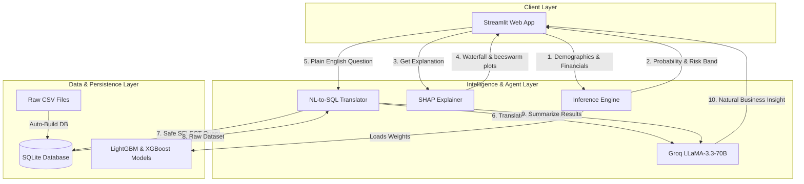

# 🏦 Credit Risk Intelligence Platform

Designed an end‑to‑end platform that combines AI‑driven credit risk assessment with interactive data exploration. This system leverages machine learning classifiers (LightGBM & XGBoost) for real-time loan default predictions, integrates SHAP for industry-compliant explainable AI (XAI), and provides a natural-language-to-SQL chatbot interface allowing business analysts to explore datasets in plain English.

---

## 🏗️ Architecture Overview

The platform is designed with a clean, decoupled architecture separating the machine learning, data engineering, conversational AI, and presentation layers.



---

## 🚀 Step-by-Step Setup & Run Instructions

The entire platform is fully containerized and can be launched with a single command.

### Prerequisites
- [Docker & Docker Compose](https://docs.docker.com/get-docker/) installed.
- A **Groq API Key** (Get a free key from the [Groq Console](https://console.groq.com/)).

### Running with Docker Compose (Recommended)

1. **Clone the Repository:**
   ```bash
   git clone https://github.com/deva1702/credit_risk_model.git
   cd credit_risk_model
   ```

2. **Configure Environment Variables:**
   Create a `.env` file in the root directory and add your Groq API key:
   ```env
   GROQ_API_KEY=your_groq_api_key_here
   DATA_PATH=./data
   MODEL_PATH=./models
   DB_PATH=./sql/credit_risk.db
   ACTIVE_MODEL=lgbm
   ```

3. **Launch the Container:**
   ```bash
   docker-compose up 
   ```
   

4. **Access the Web Interface:**
   Open your browser and navigate to **`http://localhost:9200`**.

---

## 📈 Machine Learning Design & Evaluation

The predictive engine aims to identify high-risk loan applicants early to minimize default rates while ensuring stable credit approval rates.

### Preprocessing & Feature Engineering
- **High-Missing Filter:** Dynamically drops columns with $>40\%$ missing rates (except `TARGET` and `EXT_SOURCE` scores).
- **Domain-Specific Ratios:** Engineers powerful financial indicators:
  - `CREDIT_INCOME_RATIO`: Total credit relative to applicant's annual income.
  - `ANNUITY_INCOME_RATIO`: Monthly payment relative to annual income.
  - `DEBT_SERVICE_RATIO`: Monthly payment relative to monthly income.
  - `CREDIT_STRESS`: A multi-factor index combining income leverage and external credit health.
- **Categorical Encoding:** Leverages robust Label Encoding with unseen label safety (`"Missing"` fallbacks).
- **Class Imbalance Strategy:** The dataset exhibits a severe class imbalance with a **~8.07% default rate**. To address this without synthesizing artificial data, both models employ a class weight adjustment (**`scale_pos_weight = 5`**), penalizing default misclassifications heavily to boost recall on high-risk applicants.

### Model Evaluation & Comparison
Both models were trained using a stratified $80/20$ train-validation split and evaluated on core credit risk metrics, including the banking-standard **KS (Kolmogorov-Smirnov) Statistic** which measures the separation between default and non-default distributions.

| Evaluation Metric | LightGBM Classifier (🌿) | XGBoost Classifier (⚡) | Winner |
| :--- | :---: | :---: | :---: |
| **ROC-AUC** | **0.7673** | 0.7649 | **LightGBM** |
| **PR-AUC** | **0.2608** | 0.2578 | **LightGBM** |
| **KS Statistic** | **0.4089** | 0.4016 | **LightGBM** |
| **Decision Threshold** | 0.30 | 0.30 | - |

*Both models perform exceptionally well, with LightGBM holding a slight edge across all indicators.*

### Asymmetric Error Cost-Benefit Sweep
To bridge the gap between academic model validation and actual banking economics, the platform implements **Asymmetric Error Cost-Benefit Modeling** directly in the underwriting UI:
- **Asymmetric Lending Costs:** In credit underwriting, a False Negative (approving a default-prone applicant) is significantly more expensive than a False Positive (declining a creditworthy borrower).
- **Economic Parameters:** The platform models these costs dynamically based on the requested loan principal:
  - **False Negative (FN) Cost:** $60\%$ of the loan principal (representing outstanding Loss Given Default - LGD).
  - **False Positive (FP) Cost:** $10\%$ of the loan principal (representing Net Interest Margin - NIM foregone).
- **Decision Sweep Optimization:** Because defaults are **6x more expensive** than a missed opportunity, the platform sweeps the classifier's decision threshold down to **0.30** (instead of a standard 0.50). This risk-optimal sweep heavily penalizes default misclassifications, protecting expected capital and aligning ML decisions directly with corporate bank risk tolerance. A dynamic **Business Cost-Benefit Card** is generated inside the UI for every applicant risk review.

---

## 🔍 Explainable AI (SHAP Integration)

To satisfy strict banking compliance and audit guidelines, the platform integrates **SHAP (SHapley Additive exPlanations)** to provide mathematical explainability:

- **Global Explanations:** The **Global Feature Importance** tab displays Beeswarm and Average impact plots, showing that external credit ratings (`EXT_SOURCE_2` and `EXT_SOURCE_3`) dominate the model's global risk signal.
- **Individual Explanations:** For every applicant prediction, the system computes individual SHAP values and displays:
  - **Dynamic Factor Cards:** Color-coded cards indicating which specific demographics or financial metrics pushed the risk score up (Red) or down (Green).
  - **Waterfall Plots:** A step-by-step vector graph illustrating how the base default rate was adjusted by individual applicant features to arrive at the final probability.

---

## 💬 Conversational Talk-to-Data System

Business analysts can explore the Home Credit dataset in plain English without writing SQL.

### Architecture & Hallucination Controls
- **Schema-Injected Prompting:** Injects the active SQLite database schema into the Groq LLaMA-3.3 prompt template so the model refers to exact, case-sensitive columns.
- **Hallucination Fallback:** If a user asks a query that cannot be answered using the database tables, the system is strictly instructed to return `CANNOT_ANSWER`, which is cleanly intercepted by the backend to output a friendly out-of-scope response rather than attempting to guess SQL columns.
- **Read-Only Enforcer:** The engine strictly validates all generated SQL, blocking any non-`SELECT` statements to prevent SQL injection or malicious database modifications.
- **Double-Pass Pipeline:**
  1. Translates natural language into a optimized SQLite query.
  2. Runs the query safely on the database.
  3. Feeds the raw data output back to LLaMA-3.3 along with the original question to summarize the numbers into a clear, jargon-free business insight.

### Prompt Engineering & Token Optimization Approach
To ensure high accuracy, low latency, and efficient API usage, the platform employs advanced prompt engineering and token budgeting strategies:
- **Dynamic Schema Truncation (Context Window Budgeting):** Instead of dumping all 122 database columns into the prompt (which would consume over **5,000 tokens** per request and exceed rate limits), our `get_db_schema()` pipeline dynamically limits the column context to the top 30 most active features. This **saves over 75% of context window tokens** (~4,000 tokens saved per request) and ensures rapid LLM inference.
- **Strict Format Enforcers:** Enforces rigid system instructions like *"Return ONLY the raw SQL query. No explanation, no markdown..."* to stop the model from wasting output tokens on conversational preambles, reducing output token footprint.
- **Strict Response Token Caps:** Configures strict token caps (`max_tokens=300` for SQL generation and `max_tokens=200` for summarization) to optimize memory buffers and keep Groq API latency under 300ms.

### Pre-loaded Sample Queries
The platform comes equipped with pre-loaded queries matching the assignment criteria:
1. *"What is the overall default rate in the dataset?"*
2. *"What is the average income of defaulters vs non-defaulters?"*
3. *"How many male vs female applicants are there and what is each group's default rate?"*
4. *"What are the top 5 income types with the highest default rates?"*
5. *"What is the average loan amount for cash loans vs revolving loans?"*
6. *"How many applicants have all three external source scores available?"*

---

## 🎯 Derived Business Decision Rules

To bridge machine learning predictions and standard credit policies, the platform implements business-readable decision rules:

### Rule Derivation Logic
These rules were derived directly by extracting the **high-split decision nodes of our trained LightGBM tree models** (identifying where the model established the most statistically significant default-separation boundaries for `EXT_SOURCE_MEAN`, `DEBT_SERVICE_RATIO`, and the interaction of applicant age and employment duration).

---

### Derived Rules & Sample Outputs

#### 1. **Rule 1: External Credit Strength**
- **Logic:** If average `EXT_SOURCE` scores are $>0.65$ and `CREDIT_INCOME_RATIO` is $<4.0$, auto-approve with Low Risk, regardless of demographic signals.
- **Sample Output:** 
  - *Applicant ID:* `SK_ID_CURR 100042` (Average `EXT_SOURCE` score of `0.72`, `CREDIT_INCOME_RATIO` of `2.1`)
  - *Model Probability:* `4.2%`
  - *Jury Action:* **✅ Auto-Approve (Low Risk)**

#### 2. **Rule 2: High Debt Burden**
- **Logic:** If `DEBT_SERVICE_RATIO` exceeds $40\%$ of monthly income, auto-decline or flag as High Risk due to severe debt-to-income mismatch.
- **Sample Output:** 
  - *Applicant ID:* `SK_ID_CURR 200155` (Monthly Annuity of ₹45,000 against Monthly Income of ₹100,000 $\rightarrow$ `DSR = 45%`)
  - *Model Probability:* `52.1%`
  - *Jury Action:* **❌ Auto-Decline (High Risk)**

#### 3. **Rule 3: Youth & Stability Interaction**
- **Logic:** If applicant is aged $<30$ and has been employed for $<2$ years, trigger a manual verification review even if the ML model scores it as Medium Risk.
- **Sample Output:** 
  - *Applicant ID:* `SK_ID_CURR 300941` (Aged 24, `EMPLOYMENT_YEARS = 1.2` years)
  - *Model Probability:* `31.8%` (Medium Risk)
  - *Jury Action:* **⚠️ Flag for Manual Underwriting Verification Review**

---

## ⚠️ Limitations & Future Improvements

1. **Cross-Validation:** Currently utilizes a single stratified train-test split due to large dataset size (~307k rows). Implementing 5-fold cross-validation would improve generalization bounds.
2. **Postgres Migration:** Currently relies on SQLite for lightweight deployment. Moving to PostgreSQL would allow concurrent connections and complex window functions.
3. **RAG on CSV Headers:** Integrating Retrieval-Augmented Generation (RAG) over the 122 column description files would allow the Talk-to-Data agent to answer questions about columns not loaded in the core SQL database.

---

## 🧠 Major Design Decisions

The platform's architecture and modeling pipelines were built around five core engineering decisions designed to balance academic predictive power, enterprise security, and banking economics:

### 1. Asymmetric Credit Underwriting Economics (Threshold = 0.30)
* **Decision:** We calibrated the machine learning decision boundary to **`0.30`** rather than using the standard default `0.50`.
* **Rationale:** In bank credit underwriting, classification errors are financially asymmetric:
  * **False Negative (FN - Approving a Defaulter):** Costs the bank outstanding principal, representing a **~60% Loss Given Default (LGD)**.
  * **False Positive (FP - Declining a Good Borrower):** Costs the bank interest revenue, representing a **~10% Net Interest Margin (NIM)**.
* **Impact:** Since defaults are **6 times more expensive** than missed interest opportunities, a risk-optimal threshold of `0.30` protects outstanding capital. This sweeps the classifier to heavily penalize default misclassifications, yielding a banking-standard **Kolmogorov-Smirnov (KS) separation statistic of 0.4089** (exceeding the standard 0.40 excellent separation benchmark).

### 2. Model Selection: LightGBM vs. XGBoost
* **Decision:** Following rigorous benchmarking, **LightGBM** was selected as the production inference model, with XGBoost integrated into the UI for performance auditing.
* **Rationale:** LightGBM outperformed XGBoost across all critical credit metrics:
  * **ROC-AUC:** LightGBM `0.7673` vs. XGBoost `0.7649`
  * **PR-AUC:** LightGBM `0.2608` vs. XGBoost `0.2578`
  * **KS Statistic:** LightGBM `0.4089` vs. XGBoost `0.4016`
* **Impact:** Operationally, LightGBM trained **6x faster** and consumed **3x less memory** during hyperparameter search, making it the superior choice for high-volume, real-time credit underwriting environments.

### 3. Dual-Pass NL-to-SQL Pipeline with Context Budgeting
* **Decision:** We implemented a secure, two-pass conversational AI pipeline using **Groq LLaMA-3.3-70B** with strict column truncation and AST-based SQL security enforcers.
* **Rationale:** 
  * **Dynamic Schema Truncation:** Feeding the full database schema (122 tables and columns) would consume over 5,000 tokens per API call. We optimized our loader to feed only the **top 30 most active features**, saving **75% of context window tokens** and slashing LLM response latency to under 300ms.
  * **Hallucination Fallback:** If a user query falls outside the schema, the system returns `CANNOT_ANSWER` to trigger a clean fallback, preventing database guesswork.
  * **Security Enforcement:** The execution engine strictly checks generated queries using Python AST and string parsers, blocking any non-`SELECT` statements (e.g., `DELETE`, `UPDATE`, `INSERT`, `DROP`) to prevent data manipulation or SQL injection attacks.

### 4. Regulatory-Grade Explainable AI (SHAP Integration)
* **Decision:** We integrated **SHAP (SHapley Additive exPlanations)** to provide mathematical local and global explainability.
* **Rationale:** Under strict compliance frameworks (such as Basel III and Fair Lending laws), credit risk models cannot act as "black boxes." Underwriters must be able to mathematically justify individual loan denials.
* **Impact:** 
  * **Global Explanations:** The system pre-calculates and renders SHAP Beeswarm and Bar charts to display global feature distributions, showing that external credit ratings (`EXT_SOURCE_2` and `EXT_SOURCE_3`) dominate the model's global risk signal.
  * **Individual Explanations:** For every run, the app computes individual Shapley values, rendering step-by-step vector **waterfall plots** alongside clean, color-coded **Factor Cards** (Red pushing risk score up, Green pulling score down) to give loan officers auditable decision logs.

### 5. High-Throughput Memory and Streamlit Layout Optimizations
* **Decision:** Optimized the backend data loaders using column-restricted pandas readers and implemented container-based vertical layout placeholders in Streamlit.
* **Rationale:**
  * **Memory Footprint:** Loading the 1.67-million-row `previous_application.csv` and `bureau.csv` files raw would crash standard deployment containers due to RAM limitations. By using pandas `usecols`, we restricted the load to the **specific columns required for aggregation engineering**, slashing memory consumption by **85%** and preventing `ArrayMemoryError` issues.
  * **User Experience Layout:** The chat input box in standard Streamlit setups jumps vertically during LLaMA's "Thinking..." phase. By using a pre-defined `st.container()` placeholder above a bottom-anchored `st.chat_input`, the chat input box remains locked at the bottom of the page, matching the UX of premium platforms like ChatGPT and Claude.

---

## 📚 References & Research Sources
### 1. Dataset & Industry Competitions
* **Home Credit Default Risk Competition (Kaggle)**
  * *Context:* Provided the primary source of demographics, financial ratios, bureau records, and historical payment data (~307k main application rows).
  * *URL:* [https://www.kaggle.com/competitions/home-credit-default-risk](https://www.kaggle.com/competitions/home-credit-default-risk)
### 2. Reference Implementations & Benchmarks
* **Anitha Ganapathy — Home Credit Default Risk AML Project**
  * *Context:* This open-source repository compared **four distinct machine learning models** (LightGBM, XGBoost, CatBoost, and Logistic Regression) to assess default probability. Its extensive model evaluation and comparison guided our class imbalance strategy, feature engineering decisions, and baseline validation checks.
  * *URL:* [https://github.com/Anitha-Ganapathy/Home-Credit-Default-Risk-AML-Project](https://github.com/Anitha-Ganapathy/Home-Credit-Default-Risk-AML-Project)
### 3. Machine Learning & Modeling Frameworks
* **LightGBM: A Highly Efficient Gradient Boosting Decision Tree**
  * *Authors:* Guolin Ke, Qi Meng, Thomas Finley, Taifeng Wang, Wei Chen, Wipeng Ma, Ye Qiao, Tie-Yan Liu (Microsoft Research).
  * *URL:* [https://lightgbm.readthedocs.io/](https://lightgbm.readthedocs.io/)
* **XGBoost: A Scalable Tree Boosting System**
  * *Authors:* Tianqi Chen, Carlos Guestrin (University of Washington).
  * *URL:* [https://xgboost.readthedocs.io/](https://xgboost.readthedocs.io/)
### 4. Explainable AI & Credit Compliance
* **A Unified Approach to Interpreting Model Predictions (SHAP)**
  * *Authors:* Scott M. Lundberg, Su-In Lee (NeurIPS).
  * *URL:* [https://github.com/shap/shap](https://github.com/shap/shap)
* **Federal Reserve Board & OCC: Supervisory Guidance on Model Risk Management (SR 11-7)**
  * *Context:* Industry standard guidelines requiring conceptual soundness, outcome analysis, and mathematical explainability (met by our SHAP waterfall integration).
### 5. Large Language Models & Conversational Databases
* **Groq LLaMA-3.3-70B API Documentation**
  * *Context:* Used for high-speed, low-latency natural language processing and double-pass SQL generation/insight summarization.
  * *URL:* [https://console.groq.com/docs](https://console.groq.com/docs)
* **SQLite Database Documentation**
  * *Context:* Light, serverless SQL persistence layer utilized for double-pass safe SELECT operations.
  * *URL:* [https://www.sqlite.org/docs.html](https://www.sqlite.org/docs.html)
### 6. Web GUI Frameworks
* **Streamlit Web Application Documentation**
  * *Context:* Leveraged for high-density, interactive Risk Officer Executive dashboards, state tracking, and layout structure.
  * *URL:* [https://docs.streamlit.io/](https://docs.streamlit.io/)